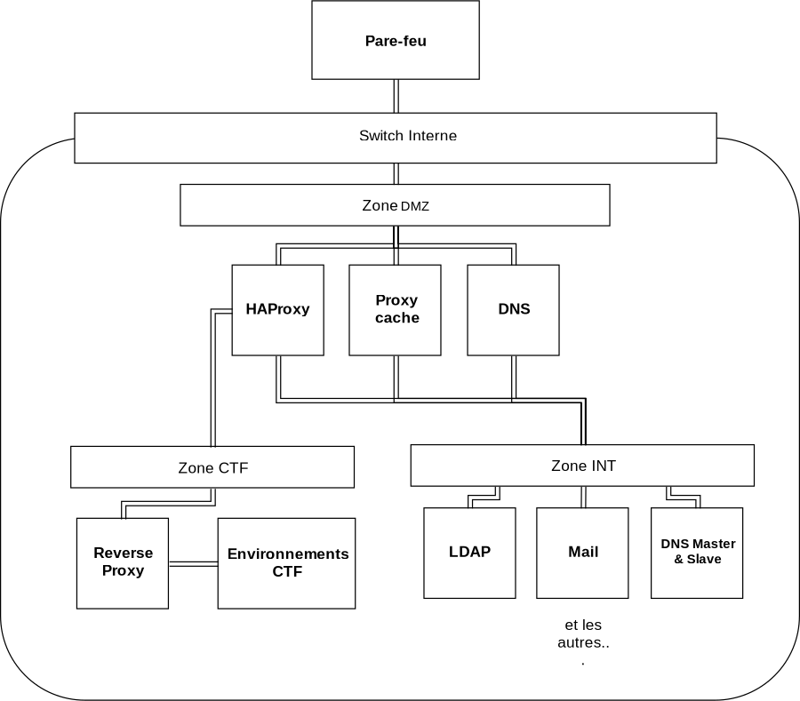

# Topologie globale de l'infrastructure
Le réseau sera découpé en deux sous-réseaux matérialisés par des switchs virtuels : le réseau interne accessible directement depuis l'extérieur et le réseau d'administration accessible uniquement via un VPN.

## Schéma simplifié de la zone interne

## Réseau WAN

Le réseau WAN permettra de faire le lien entre l'extérieur, les pare-feux et les hyperviseurs.

## Réseau Interne

Le réseau interne sera séparé en 4 zones :

- DMZ qui sera située juste après le firewall et qui contiendra les loadbalanceurs (HAProxy), le proxy interne et le serveur DNS interne.

- INT qui contiendra les conteneurs des services permanents.

- CTF qui sera la zone dédiée au reverse proxy CTF et aux conteneurs / VMs des environnements CTF. Le lien avec l'extérieur se fera directement au niveau de la DMZ via HAProxy.

- DIRTY qui contiendra les conteneurs des services en test.

Les requêtes arriveront sur le pare-feu qui effectuera un premier filtrage et transmettra les requêtes sur les ports 80 et 443 à un des loadbalanceurs, c'est le loadbalanceur qui décidera ensuite si la requête sera retransmise à l'un des reverse proxy de la zone INT ou au reverse proxy de la zone CTF.

## Réseau Administration

L'accès au réseau administration se fera grâce à un VPN. Depuis le réseau administration, on pourra accéder librement à tous les services hyperviseurs compris. Cela pourra par exemple permettre de mettre en place un système de monitoring.

De son côté, l'accès à l'interface d'administration de Proxmox se fera aussi par la voie classique. En cas de connexion à pve.krhacken.org, HAProxy vérifiera le certificat client et son CN avant de rediriger vers un des deux panels.
