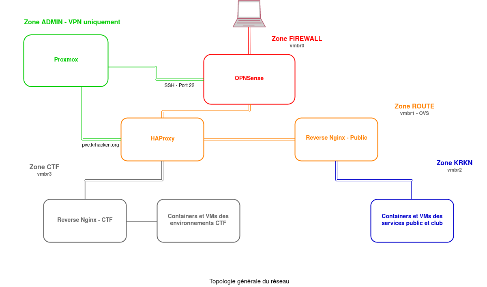

# Topologie globale de l'infrastructure

## Pour les connexions à la partie utilisateur

Le réseau local sera séparé en 3 zones privées.

- ROUTE qui sera la DMZ situé juste après le firewall et qui contiendra les loadbalancer (HAProxy) et les reverse proxy public (NGINX).

- KRKN qui contiendra les containers des services public et club la liaison entre KRKN et ROUTE se fera à travers les reverses proxy NGINX.

- CTF qui sera la zone dédiée au reverse proxy CTF et aux containers/VMs des environnements CTF.

Les requêtes arriveront sur le pare-feu qui effectura un premier filtrage et transmettra les requêtes sur les ports 80 et 443 à un des loadbalancer, c'est le loadbalancer qui décidera ensuite si la requête sera retransmise à l'un des reverses de la zone KRKN ou au reverse de la zone CTF.

## Pour les connexions à la partie administration

L'accès à l'interface d'administration de Proxmox se fera par la voie classique, en cas de connexion à pve.krhacken.org, HAProxy vérifira le certificat client et son CN avant de rediriger vers un des deux panels.

L'accès au port 8006 (port par défaut de l'UI Proxmox) et au port 22 se fera par un VPN qui sera géré par le pare feu (OPNSense) sur la zone ADMIN.

Voilà un schéma (très simplifié) de la topologie globale du réseau (user et admin)

