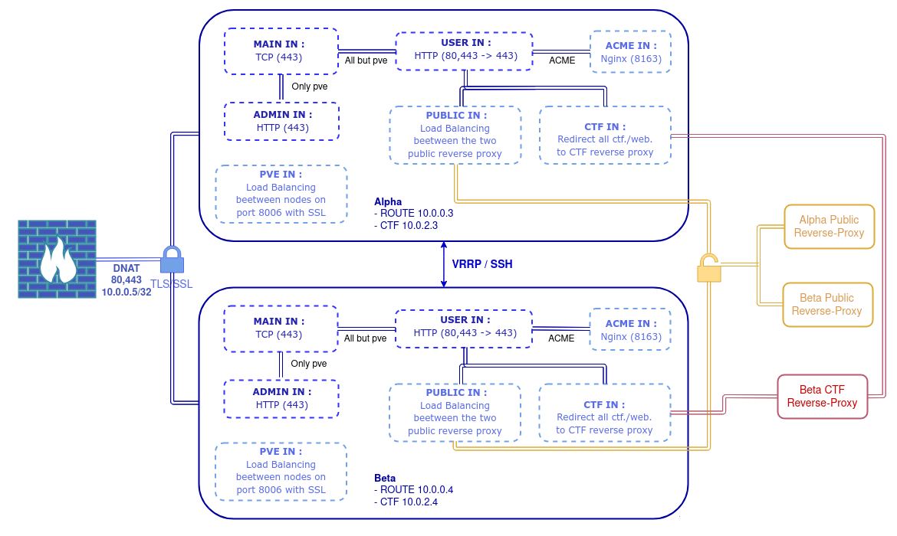

# Gestion du flux post-firewall
 
## Présentation des containers

Deux containers Debian 10 identiques, un sur Alpha l'autre sur Bêta avec deux interfaces 
- Sur Alpha le container HAProxy a comme IP 10.0.0.3/24 sur ROUTE (eth0) 10.0.1.3/24 sur CTF (eth1)
- Sur Beta le container HAProxy a comme IP 10.0.0.4/24 sur ROUTE 10.0.1.4/24 sur CTF
L'option Firewall PVE des interfaces est désactivée

## Objectifs et choix techniques

Trois objectifs pour la gestion du flux post-firewall
- Redondance du proxy/load balancer entre les deux nodes.
- Séparation des flux (reverse public et reverse ctf).
- Load balancing entre deux reverse proxy Nginx public (un sur chaque nodes).
- Connexion SSL entre l'utilisateur et le proxy.
- Vérification du certificat du client et de son CN si tentative de connexion au panel Proxmox (uniquement).


Voici les choix techniques faits afin de répondre à ces objectifs
- Pour le load balancing entre les deux reverse proxy Nginx, on utilisera HAProxy.Le lien sécurisé sera entre l'utilisateur de HAProxy qui soumettra ensuite des requêtes HTTP à un des reverse proxy Nginx.
- Pour la redondance du proxy entre les deux nodes, on utilisera keepalived et la technologie VRRP pour garantir la disponibilité du proxy via une ip virtuelle. 
- Pour la vérification du certificat client - uniquement si le client veut se connecter au panel Proxmox- on fera une première frontend à la couche 4 (TCP) pour les connexions https qui rediregera les connexions vers le panel sur une frontend dédié et le reste vers une frontend par défaut.
- Pour les certificats SSL, nous allons utiliser Let's Encrypt avec un serveur Nginx local dédié à l'obtention des certificats et des scripts pour le dépoiement sur les deux containers HAProxy.
- La séparation des flux entre les deux reverse public et le reverse ctf ce fera au niveau de la seconde frontend par défaut tout comme le filtrage des requêtes par nom de domaine.

### Voilà un schéma résumé



## Création d'un canal d'échange par clé entre les deux containers
Afin de pouvoir faire des scp de manière automatique entre les deux containers, il faut mettre en place une connexion ssh par clé en root entre les deux containers.

Le procédé est le même, en voici les variantes,
- Sur Alpha le container HAProxy aura comme IP 10.0.0.3
- Sur Beta le container HAProxy aura comme IP 10.0.0.4

### /etc/ssh/sshd_config
Remplacer la ligne concernée par
```
PermitRootLogin yes
```

### Génération et échange de la clé
```
adduser hasync
ssh-keygen -o -a 100 -t ed25519 -f /root/.ssh/id_ed25519

Alpha : ssh-copy-id -i /root/.ssh/id_ed25519 root@10.0.0.4
Beta : ssh-copy-id -i /root/.ssh/id_ed25519 root@10.0.0.3
```

### /etc/ssh/sshd_config
Remplacer les lignes concernées par
```
PermitRootLogin without-password
PubkeyAuthentication yes
```
Il est maintenant possible de se connecter par clé entre les containers


## Installation et configuration de HAProxy sur chaque node

Le procédé est le même, en voici les variantes,
- Sur Alpha le container HAProxy aura comme IP 10.0.0.3
- Sur Beta le container HAProxy aura comme IP 10.0.0.4

### Installation
```
apt-get update
apt-get install -y haproxy hatop certbot nginx
systemctl enable haproxy
systemctl enable nginx
```
Pour la vérification du certificat du client, la méthode est dans la git. Il faut placer le ca.crt dans /home/hasync/pve.crt et ajouter le CN autorisé dans /home/hasync/allowed_cn.txt

### Configuration 
Voilà une rapide explication de la configuration faite
- Une première frontend (all-web-in) de type TCP en écoute sur le port 443 qui vérifie si les requêtes tcp sont bien SSL et redirige tout vers la frontend principale via un proxy sauf les requêtes vers la panel Proxmox qui sont redirigées vers la frontend admin via un proxy.

- La frontend principale (user-web-in) de type http écoute sur le ports 80 et le proxy évoqué plus haut. Filtrage des requêtes ne respectant pas le nom de domaine et forçage du https sans www sinon rejet du packet. Redirection des requêtes Let's Encrypt vers un serveur Nginx local dédié aux certifications sinon séparation du flux avec d'un côté une backend s'occupant du load balancing entre les deux reverse proxy Nginx public et de l'autre une backend redirigeant vers le reverse proxy ctf à l'aide du nom de domaine. 

#### /etc/haproxy/haproxy.cfg 
```
global
	log /dev/log	local0
	log /dev/log	local1 notice
	chroot /var/lib/haproxy
	stats socket /run/haproxy/admin.sock mode 660 level admin expose-fd listeners
	stats timeout 30s
	user haproxy
	group haproxy
	daemon
	ca-base /etc/ssl/certs
	crt-base /etc/ssl/private
	ssl-default-bind-ciphers ECDH+AESGCM:DH+AESGCM:ECDH+AES256:DH+AES256:ECDH+AES128:DH+AES:RSA+AESGCM:RSA+AES:!aNULL:!MD5:!DSS
	ssl-default-bind-options no-sslv3
	tune.ssl.default-dh-param 2048

defaults
	log	global
	option	dontlognull
        timeout connect 5000
        timeout client  50000
        timeout server  50000
	errorfile 400 /etc/haproxy/errors/400.http
	errorfile 403 /etc/haproxy/errors/403.http
	errorfile 408 /etc/haproxy/errors/408.http
	errorfile 500 /etc/haproxy/errors/500.http
	errorfile 502 /etc/haproxy/errors/502.http
	errorfile 503 /etc/haproxy/errors/503.http
	errorfile 504 /etc/haproxy/errors/504.http

frontend all-web-in
	mode tcp
	bind *:443 interface eth0
	tcp-request inspect-delay 5s
	tcp-request content accept if { req_ssl_hello_type 1 }
	use_backend is-admin if { req_ssl_sni -i pve.sessionkrkn.fr }
	default_backend is-user
        
frontend user-web-in
	mode http
	bind *:80 interface eth0
	bind abns@haproxy-user accept-proxy ssl accept-proxy no-sslv3 crt /etc/ssl/letsencrypt interface eth0
	acl host_letsencrypt path_beg /.well-known/acme-challenge
	acl authorized_host hdr_end(host) sessionkrkn.fr
	acl ctf_host hdr_end(host) ctf.sessionkrkn.fr
	acl host_www hdr_beg(host) -i www.
	reqirep ^Host:\ www.(.*)$ Host:\ \1 if host_www !host_letsencrypt
	reqadd X-Forwarded-Proto:\ http
	reqadd X-Forwarded-Proto:\ https
	redirect scheme https code 301 if !{ ssl_fc } authorized_host !host_letsencrypt
	use_backend nginx-ctf if ctf_host
	use_backend letsencrypt if host_letsencrypt 
	use_backend reverse-nginx if authorized_host !ctf_host
	default_backend drop-http

frontend admin-in
	mode http
	bind abns@haproxy-admin accept-proxy ssl no-sslv3 crt /etc/ssl/letsencrypt ca-file /home/hasync/pve.crt verify required interface eth0
 	acl is_auth ssl_c_s_dn(cn) -i -f /etc/haproxy/allowed_cn.txt
	use_backend pve-interface if { ssl_fc_has_crt } is_auth
	default_backend drop-http
        
backend is-admin
	mode tcp
	server admin-in abns@haproxy-admin send-proxy-v2
        
backend is-user
	mode tcp
	server admin-in abns@haproxy-user send-proxy-v2

backend letsencrypt
	mode http
	http-request set-header Host letsencrypt.requests
	server letsencrypt 127.0.0.1:8164

backend pve-interface
	mode http
	balance roundrobin
	server pve-alpha 10.0.0.1:8006 check ssl verify none
	server pve-beta 10.0.0.2:8006 check ssl verify none

backend reverse-nginx
	mode http
	balance roundrobin
	server reverse1 10.0.0.6:80 check
	server reverse2 10.0.0.7:80 check

backend nginx-ctf
	mode http
	server nginx-ctf1 10.0.2.5:80 check

backend drop-http
	mode http
	http-request deny
```

Une fois HAProxy configuré, il faut configurer le serveur Nginx permettant l'obtention des certificats Let's Encrypt.

```
rm /etc/nginx/sites-enabled/default
rm /etc/nginx/sites-available/default
rm /etc/letsencrypt/live/README
mkdir -p /home/hasync/letsencrypt-requests
```

#### /etc/nginx/sites-availables/letsencrypt.conf
```
server {
    listen 8164;
    server_name letsencrypt.requests;
    root /home/hasync/letsencrypt-requests;
}
```

### Démarrage des services
```
systemctl restart nginx.service
systemctl restart haproxy.service
```
### Obtention des premiers certificats et déploiement 
```
certbot certonly --webroot -w /home/hasync/letsencrypt-requests/ -d sub.sessionkrkn.fr
```

Voici un script pour mettre en place les certificats Let's Encrypt au bon endroit qui s'occupe de propager les certificats sur l'autre container.
```
rm -f /etc/letsencrypt/live/README
rm -rf /etc/ssl/letsencrypt/*
for domain in $(ls /etc/letsencrypt/live); do 
    cat /etc/letsencrypt/live/$domain/privkey.pem /etc/letsencr$
done
scp -r /etc/ssl/letsencrypt/* root@<ip_autre_ct>:/etc/ssl/letsencrypt
ssh root@<ip_autre_ct> 'systemctl restart haproxy.service'
systemctl restart haproxy.service
```

## Mise en place de la haute disponibilité du load balancer
Voilà la configuration que nous allons mettre en place,
- Sur Alpha le container HAProxy aura comme IP 10.0.0.3
- Sur Beta le container HAProxy aura comme IP 10.0.0.4
- L'IP virtuelle 10.0.0.5 sera attribuée en fonction de la disponibilité des load balancer
- La node Alpha sera le master et la node Beta sera le Slave

### Installation (commune au deux nodes)
```
apt-get install -y keepalived
systemctl enable keepalived.service
echo "net.ipv4.ip_forward=1" >> /etc/sysctl.conf
echo "net.ipv4.ip_nonlocal_bind=1" >> /etc/sysctl.conf
sysctl -p /etc/sysctl.conf
```

### Configuration sur Alpha
Comme décrite plus haut
#### /etc/keepalived/keepalived.conf
```
vrrp_script chk_haproxy {
   script "killall -0 haproxy"
   interval 2
   weight 2
}
 
vrrp_instance VI_1 {
   interface eth0
   state MASTER
   virtual_router_id 51
   priority 101 # 101 on master, 100 on backup
   virtual_ipaddress {
       10.0.0.5 # the virtual IP
   }
   track_script {
       chk_haproxy
   }
}
```

### Configuration sur Beta
Comme décrite plus haut
#### /etc/keepalived/keepalived.conf
```
vrrp_script chk_haproxy {
   script "killall -0 haproxy"
   interval 2
   weight 2
}
 
vrrp_instance VI_1 {
   interface eth0
   state MASTER
   virtual_router_id 51
   priority 100 # 101 on master, 100 on backup
   virtual_ipaddress {
       10.0.0.5 # the virtual IP
   }
   track_script {
       chk_haproxy
   }
}
```

#### Vérification
Le retour de cette commande doit montrer l'adresse IP 10.0.0.5 sur Alpha
```
ip a | grep -e inet.*eth0
```

## Renouvellement automatique des certificats

Pour une question de simplicité d'administration, les certificats Let's Encrypt se renouvelleront automatiquement grâce à une crontab. Le problème est qu'un seul des deux containers sera accessible depuis l'extérieur. Il faut donc copier les certificats via scp entre les deux containers.

### /home/hasync/renew.sh
Voilà un script d'automatisation à mettre sur les deux containers
```
#!/bin/bash
if [ "$(ip a | grep -c "10.0.0.5")" -ge 1 ]; then
	certbot renew
	rm -rf /etc/ssl/letsencrypt/*
	for domain in $(ls /etc/letsencrypt/live); do 
		  cat /etc/letsencrypt/live/$domain/privkey.pem /etc/letsencrypt/live/$domain/fullchain.pem > /etc/ssl/letsencrypt/$domain.pem
	done
	scp -r /etc/ssl/letsencrypt/* hasync@<ip_autre_ct>:/etc/ssl/letsencrypt
else
fi
```
Le script est stocké dans /home/hasync/renew.sh, voici la crontab à ajouter (crontab -e) sur les deux containers.
```
0 4 */15 * * /bin/sh /home/hasync/renew.sh >/dev/null 2>&1
```

C'est tout pour la configuration de HAProxy, la prochaine étape est la mise en place des trois reverses proxy.